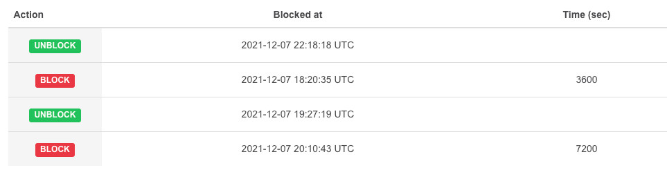
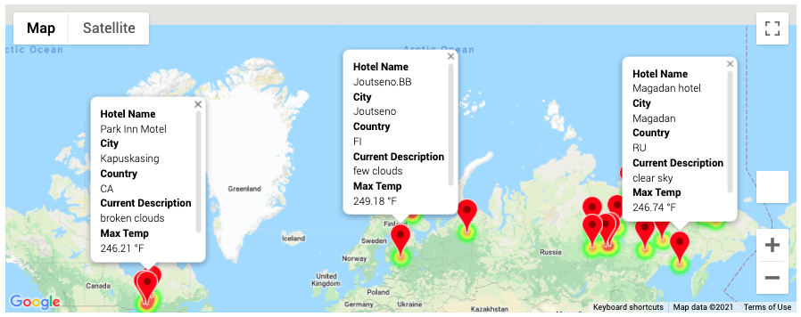
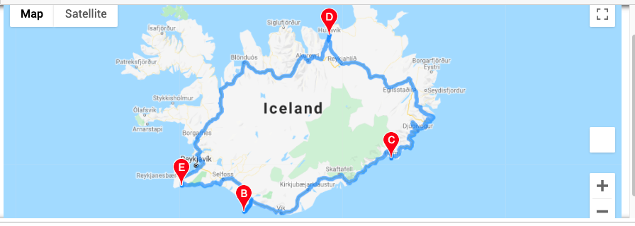

# World Weather Analysis

How might we provide real-time suggestions for our client's ideal hotels? My first task was to define what it meant by "ideal." So, over the course of the conversation, I narrowed that to hotels that were:
* within a given range of latitude and longitude
* provided the right kind of weather for the client

Outline of project plan:

* Task: Collect and analyze weather data across cities worldwide.
* Purpose: PlanMyTrip will use the data to recommend ideal hotels based on clients' weather preferences.
* Method: Create a Pandas DataFrame with 2000 or more of the world's unique cities and their weather data in real time. This process will entail collecting, analyzing, and visualizing the data.


## Background

Jack loves the PlanMyTrip app. Beta testers love it too. And, as with any new product, they’ve recommended a few changes to take the app to the next level. Specifically, they recommend adding the weather description to the weather data you’ve already retrieved in this module.
Then, I will have the beta testers use input statements to filter the data for their weather preferences, which will be used to identify potential travel destinations and nearby hotels.
From the list of potential travel destinations, the beta tester will choose four cities to create a travel itinerary. Finally, using the Google Maps Directions API, I will create a travel route between the four cities as well as a marker layer map.

## Overview of Project

### Purpose

Deliverables for next level PlanMyTrip:
* Adding the weather description to the weather data
* Take user input to filter data for their weather preferences
* Weather preferences input will be used to identify potential travel destinations & hotels
* From the potential travel destination lists, user will be able to choose 4 destinations.
* These 4 destinations will be considered one travel itinerary and using Google Maps Directions API, will create a travel route between the four cities as well as a marker layer map.

## Analysis And Challenges

## Methodology: Analytics Paradigm

#### 1. Decomposing the Ask
1. To enable beta users to input their preferred temperatures and directions for 4 different locations that they would travel.

#### 2. Identify the Datasource

Create & Collect the Data

1. OpenWeatherMap Utilisation:
* Use the NumPy module to generate more than 1,500 random latitudes and longitudes.
* Use the citipy module to list the nearest city to the latitudes and longitudes.
* Use the OpenWeatherMap API to request the current weather data from each unique city in your list.
* Parse the JSON data from the API request.
* Collect the following data from the JSON file and add it to a DataFrame:
  - City, country, and date
  - Latitude and longitude
  - Maximum temperature
  - Humidity
  - Cloudiness
  - Wind speed
  - Weather Description
  - Exploratory Analysis with Visualization

2. Google Maps Utilisation:
  * Find a hotel from the cities' coordinates using Google's Maps and Places API, and Search Nearby feature.
  * Store the name of the first hotel in the DataFrame.

#### 3. Define Strategy & Metrics
**Resource:** Python 3.6, Anaconda, Jupyter Notebook, OpenWeatherMap API, Google Maps API.


Create scatter plots of the weather data for the following comparisons:
* Latitude versus temperature
* Latitude versus humidity
* Latitude versus cloudiness
* Latitude versus wind speed

Determine the correlations for the following weather data:
* Latitude and temperature
* Latitude and humidity
* Latitude and cloudiness
* Latitude and wind speed

Create a series of heatmaps using the Google Maps and Places API that showcases the following:
* Latitude and temperature
* Latitude and humidity
* Latitude and cloudiness
* Latitude and wind speed
* Visualize Travel Data

Create a heatmap with pop-up markers that can display information on specific cities based on a customer's travel preferences.
* Filter the Pandas DataFrame based on user inputs for a minimum and maximum temperature.
* Create a heatmap for the new DataFrame.
* Find a hotel from the cities' coordinates using Google's Maps and Places API, and Search Nearby feature.
* Store the name of the first hotel in the DataFrame.
* Add pop-up markers to the heatmap that display information about the city, current maximum temperature, and a hotel in the city.

#### 4. Data Retrieval Plan
* Generate random latitudes, longitudes with function random.
```
lats = np.random.uniform(low=-90.000, high=90.000, size=9000)
lngs = np.random.uniform(low=-180.000, high=180.000, size=9000)
```
* Use the lat, long above with openweathermap.org API to find nearest cities for the coordinates and generate a cities database. Save that into:
```
WeatherPy_Database.csv
```

#### 5. Assemble & Clean the Data
Indicated in [Define Strategy & Metrics](#define-strategy--metrics)

#### 6. Analyse for Trends
Indicated in [Define Strategy & Metrics](#define-strategy--metrics)

#### 7. Acknowledging Limitations
* To always generate the same random latitude and longitude.
```
np.random.seed(74)
```
* The free account for openweathermap.org only allows 60 calls/minute and 1,000,000 calls/month.

Therefore in order to not constantly get blocked from making API call, I had to slow down the script by making the for loop wait for a 1 seconds (therefore never exceeding 60 calls per minute) between each API call using time function. See the code snippet below.
```
time.sleep(1)
```

#### 8. Making the Call:
The "Proper" Conclusion is indicated below on [Summary](#summary)

## Analysis

* Weather_Database
Generates _**2262 cities**_ with latitude & longitude, then uses openweathermap API to get the corresponding weather information which is then stored in  WeatherPy_Database.csv.

* Vacation_Search
Uses WeatherPy_Database.csv from previous repository as dataset for user to choose their vacation spots from. User then inputs their preffered min and max temperature to narrow their search. This generated input generated results where some of the Hotel Names are blank. After data cleanup, no records will have NULL value. These hotel information are in WeatherPy_vacation.csv. These hotels are then populated on google maps with their information as seen below.

>User Temperature Input Hotel Search



* Vacation_Itinerary
Uses WeatherPy_Database.csv from previous repository as dataset for user to choose
>Travel itinerary



## Summary

This project was initially frustrating as I hit both the openweathermap API max call-per-minute and exceeded the free USD$200 google API free threshold  but the final outcome was quite beautiful and fun!


## Appendix
